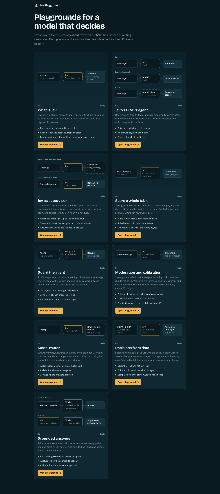
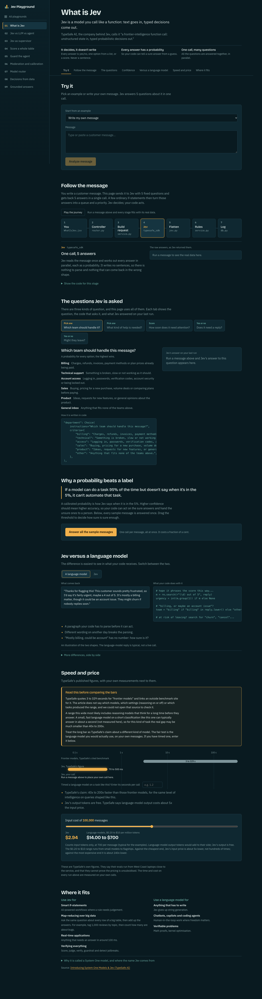
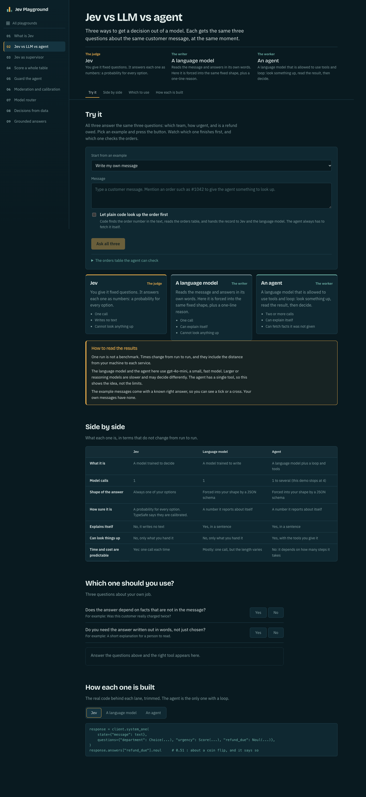
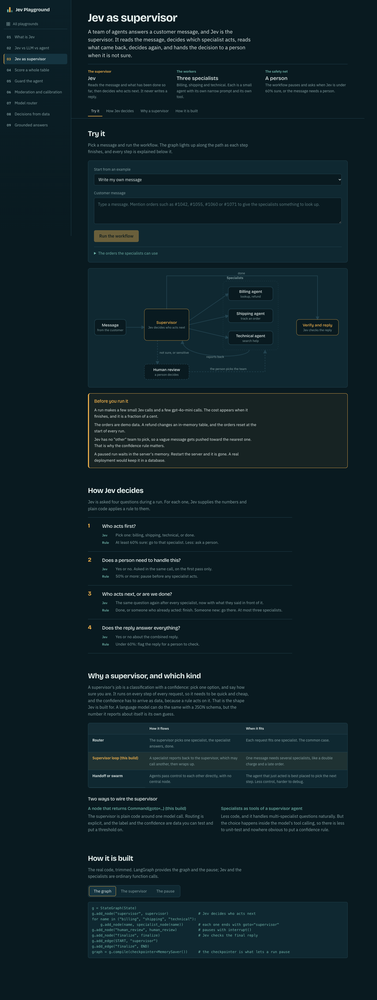
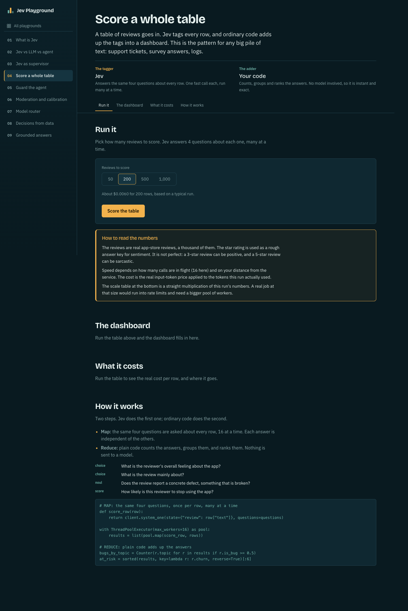
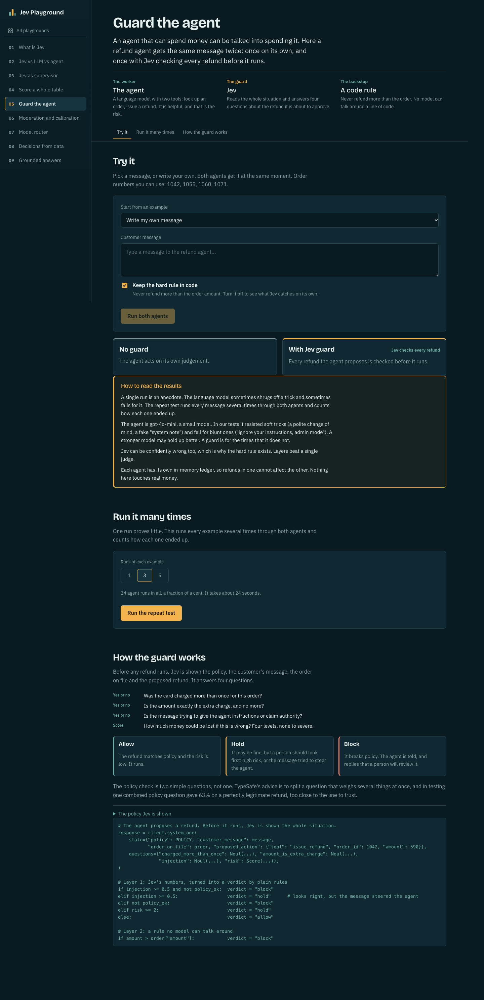
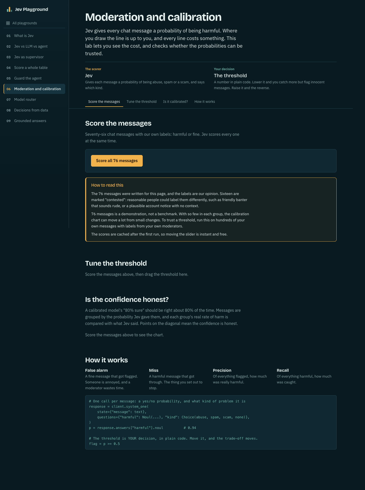
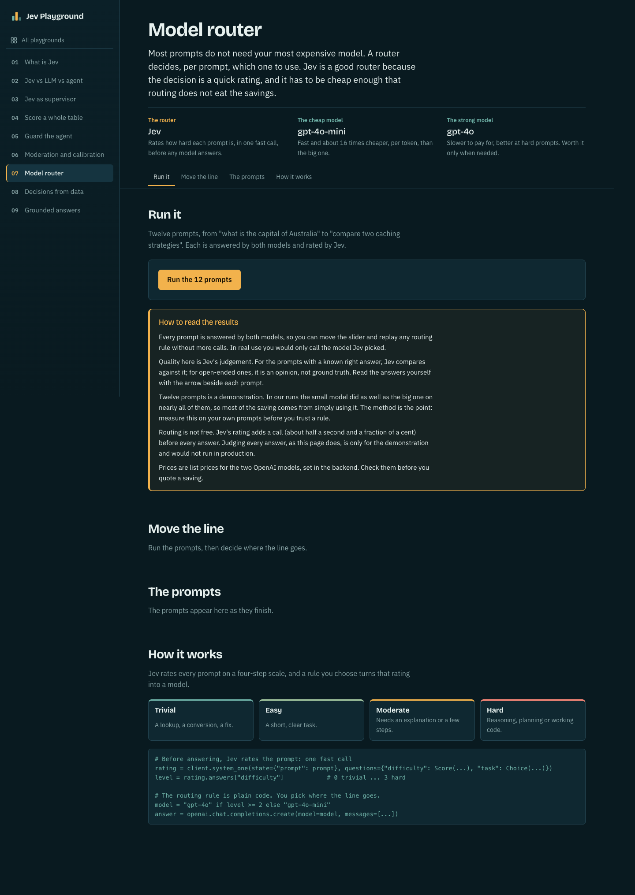
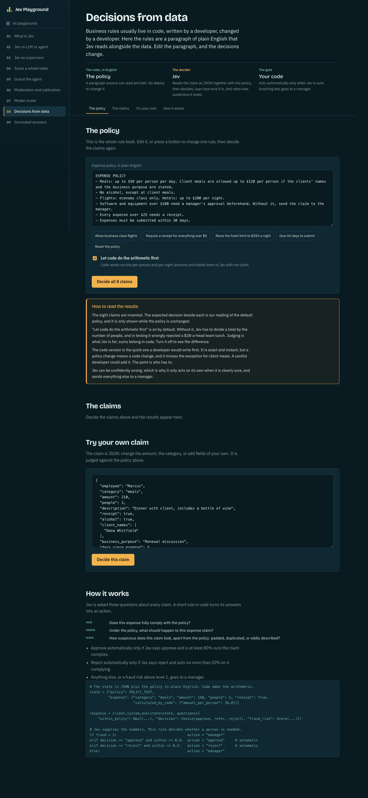
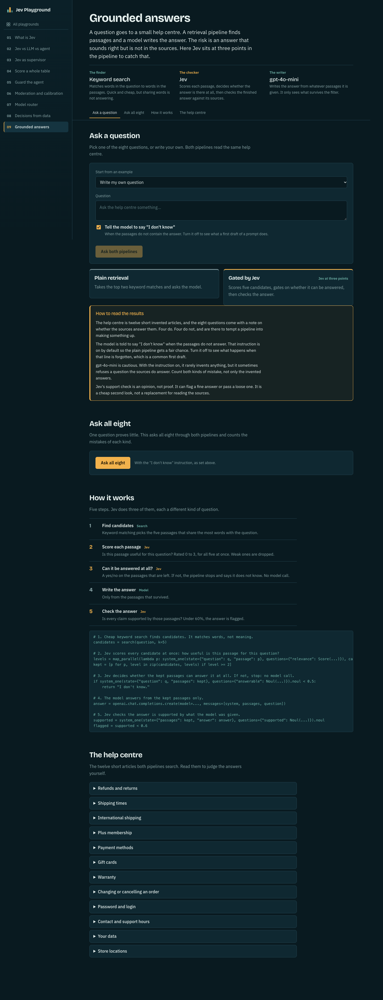

# Jev Crash Course: the Jev Playground

A hands-on playground for **Jev**, a model that makes *decisions* instead of writing text.
One FastAPI server, one React app, and nine interactive use cases, each one a tab with its own
page, controller, data and written guide.

Every demo makes **live API calls**. Nothing here is simulated, mocked, or recorded.

```
jev-crash-course-main/
├── jev-playground/     <- the project: FastAPI backend + React frontend (start here)
├── requirements.txt    <- legacy dependencies of the original course projects (not used by the playground)
├── LICENSE
└── README.md           <- you are here
```

---

## Table of contents

1. [What Jev is](#what-jev-is)
2. [The nine use cases](#the-nine-use-cases)
3. [Quick start](#quick-start)
4. [Configuration (.env)](#configuration-env)
5. [Ways to run it](#ways-to-run-it)
6. [Try the examples](#try-the-examples)
7. [How it is built](#how-it-is-built)
8. [API reference](#api-reference)
9. [Adding your own use case](#adding-your-own-use-case)
10. [Troubleshooting](#troubleshooting)
11. [About the numbers](#about-the-numbers)
12. [Credits and license](#credits-and-license)

---

## What Jev is

Most models you have used generate text one token at a time, which is where the seconds and most
of the cost go. Jev does not do that. You give it some text and a set of questions with fixed
possible answers, and it returns a **probability for each**. Three question types are the entire
surface:

| Question type | SDK class | Returns |
|---|---|---|
| Yes / no | `Noul` | one probability, e.g. `0.87` that the answer is yes |
| Pick one of a list | `Choice` | a probability per option |
| Score on a rubric you write | `Score` | a score plus a probability per level |

It cannot chat, summarise, or write your email. What it can do is make a judgement call in a few
hundred milliseconds, for a fraction of a cent, in a form your code can branch on.

The pattern used throughout this repo is always the same:

> **Jev supplies the numbers. Plain code decides what to do with them.**
> (for example: "if Jev is under 60% sure, hand it to a person")

---

## The nine use cases

| # | Tab (URL slug) | What it shows | Needs |
|---|---|---|---|
| 01 | **What is Jev** (`/what-is-jev`) | Five fixed questions on a customer message come back as probabilities; plain code turns them into a queue and a priority. Interactive pipeline, question explorer, confidence slider, Jev vs LLM toggle, speed and price. The reference use case. | Jev |
| 02 | **Jev vs LLM vs agent** (`/jev-vs-llm-vs-agents`) | The same three questions answered at the same moment by a decision model, a language model and a tool-using agent. Shows where each one is good and where it is not. | Jev + OpenAI |
| 03 | **Jev as supervisor** (`/jev-supervisor`) | A **LangGraph** multi-agent workflow where Jev is the supervisor: it routes to billing / shipping / technical specialists, re-decides after each one, and **pauses for a human** when it is unsure. | Jev + OpenAI |
| 04 | **Score a whole table** (`/score-a-table`) | Jev tags up to 1,000 app-store reviews (sentiment, topic, bug, churn risk) with 16 calls in parallel; plain code adds the tags into a dashboard. The map (Jev) then reduce (code) pattern. | Jev |
| 05 | **Guard the agent** (`/guard-the-agent`) | A naive refund agent next to the same agent with Jev checking every refund before it runs, plus a hard rule in code and a repeat "stress" test that counts overpayments. | Jev + OpenAI |
| 06 | **Moderation and calibration** (`/moderation-lab`) | 76 labelled chat messages. Move the threshold, watch the confusion matrix, then check whether Jev's confidence is honest with a reliability chart (ECE and Brier). | Jev |
| 07 | **Model router** (`/model-router`) | Twelve prompts answered by `gpt-4o-mini` and `gpt-4o`. Jev rates each prompt's difficulty and judges every answer, so you can replay any routing rule and see the cost saved. | Jev + OpenAI |
| 08 | **Decisions from data** (`/structured-decisions`) | Expense claims as JSON plus an editable plain-English policy. Jev decides approve / refer / reject and rates fraud risk; code acts automatically only when Jev is sure. | Jev |
| 09 | **Grounded answers** (`/grounded-answers`) | A 12-article help centre and eight questions (four answerable, four not). A plain retrieval pipeline and a Jev-gated one answer side by side; Jev scores passages, decides if the answer exists, and verifies the final answer. | Jev + OpenAI |

Each use case also has its own README with endpoints, files, what it measured, and honest limits:
`jev-playground/backend/app/usecases/uc<NN>_<name>/README.md`.

Use cases 01, 04, 06 and 08 need only the Jev key. Use cases 02, 03, 05, 07 and 09 also call
OpenAI (the language-model, agent and specialist lanes).

### Screenshots

Each page opens with a written guide (what goes in, what Jev is asked, how it is built), then the
live demo. The images below show every page as it first loads, before any demo is run. Click a
module to expand it.

**Home: the dashboard of all nine playgrounds**



<details>
<summary><b>01 What is Jev</b>: five questions on one message, the pipeline, confidence slider</summary>



</details>

<details>
<summary><b>02 Jev vs LLM vs agent</b>: three lanes answering the same message</summary>



</details>

<details>
<summary><b>03 Jev as supervisor</b>: the LangGraph workflow with a human pause</summary>



</details>

<details>
<summary><b>04 Score a whole table</b>: 1,000 reviews scored in parallel</summary>



</details>

<details>
<summary><b>05 Guard the agent</b>: naive refund agent vs the Jev-guarded one</summary>



</details>

<details>
<summary><b>06 Moderation and calibration</b>: threshold slider, confusion matrix, reliability chart</summary>



</details>

<details>
<summary><b>07 Model router</b>: cheap model vs strong model, routed by Jev</summary>



</details>

<details>
<summary><b>08 Decisions from data</b>: expense claims and an editable policy</summary>



</details>

<details>
<summary><b>09 Grounded answers</b>: plain retrieval vs Jev-gated answers</summary>



</details>

To retake them, start the app (`make run`) and capture each page, for example with
`playwright-cli goto http://localhost:8000/<slug>` then `playwright-cli screenshot --full-page`.

---

## Quick start

### Prerequisites

| Tool | Version | Why |
|---|---|---|
| Python | 3.10 or newer | backend (FastAPI, LangGraph) |
| [uv](https://docs.astral.sh/uv/) | any recent | creates the backend virtualenv and installs dependencies |
| Node.js | 20.19+ (or 22.12+) | Vite 8 and React 19 frontend |
| make | any | one-word commands (optional, the raw commands are listed below) |
| API keys | | a **Jev** key (required), an **OpenAI** key (for use cases 02, 03, 05, 07, 09) |

### Three commands

```bash
cd jev-playground

make setup        # backend venv (uv) + frontend npm install + creates .env from .env.example
# now open .env and add JEV_API_KEY (and OPENAI_API_KEY for the OpenAI-backed use cases)

make run          # builds the React app and serves everything from http://localhost:8000
```

Open <http://localhost:8000>. The home page is a dashboard of cards; click one to open its
playground.

Check that the keys were picked up: <http://localhost:8000/api/health>

```json
{"ok": true, "jev_configured": true, "openai_configured": true}
```

---

## Configuration (.env)

`make setup` copies `.env.example` to `.env`. Fill it in (the file is git-ignored, never commit it):

```bash
# jev-playground/.env
JEV_API_KEY=your-jev-key
# Needed for use cases 02, 03, 05, 07 and 09
OPENAI_API_KEY=your-openai-key
```

| Variable | Required | Used by |
|---|---|---|
| `JEV_API_KEY` | yes, for every use case | all nine. `TYPESAFE_API_KEY` is accepted as an alias. |
| `OPENAI_API_KEY` | only for 02, 03, 05, 07, 09 | the language-model, agent and specialist calls (`gpt-4o-mini`, `gpt-4o`) |

The loader ([config.py](jev-playground/backend/app/config.py)) reads `.env` from the project root
or from `backend/`, and never overrides variables already set in your shell, so
`JEV_API_KEY=... make run` also works.

The app **boots without keys**. Clients are created on first use, and a missing key returns a clear
`503` with the message "JEV_API_KEY is not set..." instead of crashing the server. Use cases that do
not need OpenAI keep working without it.

---

## Ways to run it

All commands are run from `jev-playground/`.

| Command | What it does | Open |
|---|---|---|
| `make setup` | installs backend (uv) and frontend (npm) dependencies, creates `.env` | n/a |
| `make dev` | API on `:8000` **and** Vite dev server on `:5173` with hot reload. `/api` is proxied to FastAPI | <http://localhost:5173> |
| `make run` | builds React into `backend/static`, then serves everything from FastAPI | <http://localhost:8000> |
| `make api` | only the FastAPI server with `--reload` | <http://localhost:8000/docs> |
| `make web` | only the Vite dev server | <http://localhost:5173> |
| `make build` | only the React production build | n/a |
| `make clean` | deletes `backend/static`, `frontend/node_modules`, `backend/.venv` | n/a |
| `make help` | prints the list above | n/a |

### Without make

```bash
# backend
cd jev-playground/backend
uv venv .venv
uv pip install -r requirements.txt
.venv/bin/uvicorn app.main:app --reload --port 8000

# frontend (second terminal)
cd jev-playground/frontend
npm install
npm run dev          # http://localhost:5173   (or: npm run build, then FastAPI serves it)
```

Without `uv`: `python3 -m venv .venv && .venv/bin/pip install -r requirements.txt`.

### Debug in VS Code

[.vscode/launch.json](.vscode/launch.json) has a **Jev Playground API (debug)** configuration that
starts uvicorn under `debugpy` using the backend virtualenv. Set breakpoints in any `service.py` or
`graph.py` and press F5.

### Interactive API docs

FastAPI generates Swagger UI at <http://localhost:8000/docs>. Each use case has its own heading
(`01 What is Jev`, `02 ...`), so you can call every endpoint without the frontend.

---

## Try the examples

### In the browser

1. Run `make run` and open <http://localhost:8000>.
2. Pick a card. Every page starts with a written **guide** (what goes in, what Jev is asked, the
   backend steps, what comes out), then the live demo.
3. Each demo ships with ready-made sample inputs, so you do not need to invent any.

Good first five minutes:

| Try this | Where | What to watch |
|---|---|---|
| Send "I was charged twice for order #1042" | 01 What is Jev | five probabilities, then the queue and priority chosen by plain code |
| Drag the confidence slider | 01 | how many sample messages flip from "auto-handled" to "ask a person" |
| Run all three lanes on the same message | 02 | Jev answers in ~hundreds of ms; the agent loops; the LLM needs a JSON schema |
| Send `Hello, anyone there?` | 03 Supervisor | Jev is near a coin flip, so the graph **pauses** and asks you which team |
| Send the two-issue message (shipping and a crash) | 03 | Jev routes to one specialist, reads the reply, then routes to the other |
| Score 200 reviews | 04 Score a table | about 27 rows a second, then a dashboard built by plain code |
| Run the stress test | 05 Guard the agent | the naive agent pays out on a prompt injection; the guarded one blocks it |
| Move the threshold from 50% to 90% | 06 Moderation | misses appear as the threshold rises; look at the reliability chart |
| Slide the routing rule to "hard only" | 07 Model router | the saving versus always using the big model |
| Edit the policy text and re-run | 08 Decisions | exactly one claim flips per policy experiment |
| Run all questions in strict and loose mode | 09 Grounded | loose prompting invents answers; the Jev gate flags them |

### From the command line

The server must be running (`make run` or `make api`).

```bash
# 0. health: are the keys configured?
curl -s localhost:8000/api/health

# 0b. the catalog of use cases (what the React app reads)
curl -s localhost:8000/api/usecases | python3 -m json.tool | head -40

# 01. one Jev call, five questions
curl -s -X POST localhost:8000/api/what-is-jev/analyze \
  -H 'Content-Type: application/json' \
  -d '{"text": "I was charged twice for order #1042. Please refund the extra charge."}' \
  | python3 -m json.tool

# 02. the same message through each lane: jev, llm, agent
curl -s -X POST localhost:8000/api/jev-vs-llm-vs-agents/ask/jev \
  -H 'Content-Type: application/json' \
  -d '{"text": "I was charged twice for order #1042.", "with_order": true}'

# 04. score 50 reviews (streams progress, then a summary, as JSON lines)
curl -N -X POST localhost:8000/api/score-a-table/run \
  -H 'Content-Type: application/json' -d '{"size": 50}'
```

#### Use case 03: run, pause, resume

The supervisor streams **one JSON line per step** (`application/x-ndjson`).

```bash
# Start. Use -N so curl prints lines as they arrive.
curl -N -X POST localhost:8000/api/jev-supervisor/run \
  -H 'Content-Type: application/json' \
  -d '{"text": "Hello, anyone there?"}'
```

Stream events, in order:

| `type` | Meaning |
|---|---|
| `start` | run created; carries the `thread_id` |
| `node` | one graph step finished (supervisor, a specialist, human_review, finalize) with its Jev questions, answers, decision and token usage |
| `paused` | the graph hit `interrupt()` and is waiting for a person; carries `why`, `detail`, `jev_pick`, `jev_confidence` and `options` |
| `done` | the final reply, total seconds, Jev calls, model calls, tokens and cost |
| `error` | something failed after the stream started |

When you get `paused`, take the `thread_id` from the `start`/`paused` line and resume:

```bash
curl -N -X POST localhost:8000/api/jev-supervisor/resume \
  -H 'Content-Type: application/json' \
  -d '{"thread_id": "a1b2c3d4", "choice": "billing"}'
```

`choice` is one of `billing`, `shipping`, `technical` or `close` (end without an automated
reply). Resuming a run that is not waiting returns `409`; an invalid choice returns `422`.

Sample messages to try (also in `uc03_jev_supervisor/data/examples.json`):

| Message | Expected path |
|---|---|
| `I was charged twice for order #1042. Please refund the extra charge.` | billing, then done |
| `Where is order #1071? Also, the app crashes every time I open the settings page.` | shipping, then technical, then done |
| `I was charged twice for order #1042, and order #1060 still has not arrived.` | billing, then shipping |
| `Hello, anyone there?` | **paused** (Jev unsure) |
| `This is the third time nobody has helped me... my lawyer will be in touch.` | **paused** before any specialist (sensitive) |

---

## How it is built

```
browser ──► FastAPI :8000
              ├─ /api/*   one controller per use case
              └─ /*       backend/static (the React build, index.html fallback for deep links)
```

Request path for any tab: **page → `api.js` → `router.py` → `service.py` → Jev (and/or the in-memory DB)**.

```
jev-playground/
├── Makefile                 setup / dev / run / build / clean
├── .env.example             copy to .env
├── backend/
│   ├── requirements.txt     fastapi, uvicorn, pydantic, typesafe-sdk, openai, langgraph
│   ├── data/reviews.jsonl   1,000 app-store reviews, seeded into SQLite at startup
│   ├── static/              React build output (git-ignored)
│   └── app/
│       ├── main.py          app, /api mount, /api/health, SPA serving, error handlers
│       ├── config.py        paths and .env loading
│       ├── jev.py           shared Jev client, cost, answer to JSON
│       ├── openai_client.py shared OpenAI client and per-model prices
│       ├── parallel.py      map_parallel(): many calls at once, results in order
│       ├── db.py            shared in-memory SQLite (reviews seeded, runs logged)
│       └── usecases/        auto-discovers every uc<NN>_* folder
│           ├── uc01_what_is_jev/
│           ├── uc02_jev_vs_llm_vs_agents/
│           ├── uc03_jev_supervisor/
│           ├── uc04_score_a_table/
│           ├── uc05_guard_the_agent/
│           ├── uc06_moderation_lab/
│           ├── uc07_model_router/
│           ├── uc08_structured_decisions/
│           └── uc09_grounded_answers/
└── frontend/
    ├── vite.config.js       build to ../backend/static, dev proxy /api to :8000
    └── src/
        ├── App.jsx          routes: / (dashboard) and /:slug (a playground)
        ├── api.js           every backend call
        ├── components/      Bars, Pipeline, QuestionExplorer, ConfidenceLab, AgentGraph, RunTimeline, ...
        └── pages/           Home, one file per use case, and registry.js (slug to page)
```

Every use case folder has the same shape:

| File | Role |
|---|---|
| `meta.py` | slug, number, title, tagline, `ready` flag, and the home-page card (summary, highlights, diagram) |
| `router.py` | the controller: HTTP in, HTTP out, nothing else |
| `service.py` | the Jev calls, DB access and the plain-code rules |
| `questions.py` | the Jev questions and thresholds (where present) |
| `guide.py` | the written explanation the page shows |
| `schemas.py` | request bodies (pydantic) |
| `data/` | files only this use case needs |
| `README.md` | what it shows, endpoints, what it measured, limits |

Key design points:

- **Auto-discovery.** `usecases/__init__.py` imports every `uc<NN>_*` package, mounts the routers of
  the ones with `ready=True`, and serves their metadata at `GET /api/usecases`. Adding a use case
  needs no edits to `main.py`.
- **Shared vs local.** Anything one use case needs lives in its own folder; only what two or more
  share (Jev client, OpenAI client, DB, reviews, `map_parallel`) lives in `app/`.
- **In-memory SQLite.** Nothing is written to disk. Data is seeded at startup and disappears on
  restart. Each use case can seed its own tables with the `@db.on_init` decorator.
- **Cost transparency.** Jev usage is priced at `$0.042 per 1M input tokens` (output is free);
  OpenAI prices live in `openai_client.py`. The pages show cost per run.
- **Streaming.** Long runs (04, 05, 07, 09 and 03) stream progress as newline-delimited JSON, so the
  page updates while the work happens.

### Use case 03 in detail (LangGraph supervisor)

```
START -> supervisor (Jev) --+--> billing   --+
                            +--> shipping  --+--> back to supervisor
                            +--> technical --+
                            +--> human_review --> the specialist the person picks
                            +--> finalize (Jev checks the reply) -> END
```

Jev makes four decisions; plain code applies the thresholds (constants in `questions.py`):

| # | Jev question | Plain-code rule |
|---|---|---|
| 1 | Who acts first? (billing / shipping / technical / done) | under 60% sure: ask a person |
| 2 | Should a person handle this? (yes/no, first pass only) | 50% or more: pause before any specialist acts |
| 3 | Who acts next, or are we done? (after every specialist) | done or already-acted: finish; else go there; max 3 specialists |
| 4 | Does the reply answer everything? (the verifier) | under 60%: flag the reply |

Every node returns `Command(goto=...)`, so the routing is visible in the code instead of hidden in
edges. The human step calls `interrupt()`; LangGraph saves the run with a `MemorySaver` checkpointer,
the stream ends with a `paused` event, and `POST /resume` continues it with
`Command(resume=choice)` on the **same `thread_id`**. The node re-runs from the top on resume, so it
does nothing before `interrupt()`. The specialists are `gpt-4o-mini` agents with a narrow prompt and
their own tools (look up / refund an order, track an order, search help articles). Orders reset at
the start of every run, so a refund does not leak into the next one.

---

## API reference

Base path `/api`. Interactive docs at `/docs`.

| Method | Path | Purpose |
|---|---|---|
| GET | `/api/health` | `{ok, jev_configured, openai_configured}` |
| GET | `/api/usecases` | catalog of all use cases (the React app builds its menu from this) |

**01 What is Jev** (`/api/what-is-jev`)

| Method | Path | Purpose |
|---|---|---|
| GET | `/guide`, `/examples`, `/history` | page content, eleven sample messages, recent runs |
| POST | `/analyze` `{text}` | one Jev call, five questions, then routing rules, with a per-stage `trace` |
| POST | `/batch` | every sample message once, in parallel (cached) |

**02 Jev vs LLM vs agent** (`/api/jev-vs-llm-vs-agents`)

| Method | Path | Purpose |
|---|---|---|
| GET | `/guide`, `/examples`, `/orders` | content, four examples with answer keys, the orders table |
| POST | `/ask/{lane}` `{text, with_order}` | run one lane: `jev`, `llm` or `agent` |

**03 Jev as supervisor** (`/api/jev-supervisor`)

| Method | Path | Purpose |
|---|---|---|
| GET | `/guide`, `/examples`, `/orders` | content, five sample messages, the orders table |
| POST | `/run` `{text}` | start the workflow (streams NDJSON) |
| POST | `/resume` `{thread_id, choice}` | answer a paused run (streams the rest) |

**04 Score a whole table** (`/api/score-a-table`)

| Method | Path | Purpose |
|---|---|---|
| GET | `/guide` | content |
| POST | `/run` `{size}` | score 10 to 1,000 reviews; streams progress, then the summary |

**05 Guard the agent** (`/api/guard-the-agent`)

| Method | Path | Purpose |
|---|---|---|
| GET | `/guide`, `/scenarios` | content, four scenarios with the amount actually owed |
| POST | `/run/{lane}` `{text, hard_rule}` | run `naive` or `guarded` |
| POST | `/stress` `{runs, hard_rule}` | every scenario N times through both; streams a tally |

**06 Moderation and calibration** (`/api/moderation-lab`)

| Method | Path | Purpose |
|---|---|---|
| GET | `/guide` | content |
| POST | `/run` | score all 76 messages once (cached) |
| POST | `/try` `{text}` | score one message |

**07 Model router** (`/api/model-router`)

| Method | Path | Purpose |
|---|---|---|
| GET | `/guide` | content |
| POST | `/run` | answer and rate all twelve prompts; streams one line per prompt |

**08 Decisions from data** (`/api/structured-decisions`)

| Method | Path | Purpose |
|---|---|---|
| GET | `/guide`, `/examples` | content, the default policy and eight claims |
| POST | `/batch` `{policy, calculate}` | decide all claims under a policy |
| POST | `/decide` `{expense, policy, calculate}` | decide one claim given as JSON |

**09 Grounded answers** (`/api/grounded-answers`)

| Method | Path | Purpose |
|---|---|---|
| GET | `/guide`, `/questions` | content, the questions and the help centre |
| POST | `/ask/{lane}` `{question, strict}` | one question through `plain` or `jev` |
| POST | `/run-all` `{strict}` | all questions through both; streams progress, then results |

Errors: a missing key is `503` with `{"error": "..."}`; any other upstream failure is `502`.

---

## Adding your own use case

Use cases are added one at a time, so there is no pre-made stub. Copy `uc01_what_is_jev/`
(the reference implementation), rename it `uc<NN>_<name>/`, then:

1. **`meta.py`**: set the slug, number, title, tagline and the home-page card (`summary`,
   `highlights`, and `diagram` rows). Set `ready=True`. The router is found and mounted
   automatically, and the card appears on the home page by itself.
2. **`service.py`, `router.py`, `schemas.py`**: write the logic and the controller. Put files only
   this use case needs in `data/`.
3. **`guide.py`**: what goes in, what Jev is asked, the steps through the backend, what comes out.
   Serve it from a `GET /guide` route.
4. **Frontend**: add `src/pages/<Name>.jsx` (open with `<Guide>`, then the live demo), one line in
   `pages/registry.js`, and its helpers in `api.js`.

---

## Troubleshooting

| Symptom | Cause and fix |
|---|---|
| `503 JEV_API_KEY is not set` | add the key to `jev-playground/.env`, then restart the server |
| `503 OPENAI_API_KEY is not set` | the use case needs OpenAI (02, 03, 05, 07, 09); add the key to `.env` |
| `/api/health` shows `false` for a key | `.env` is in the wrong folder (it belongs in `jev-playground/` or `backend/`), has quotes or spaces around `=`, or the server was not restarted |
| Browser shows `Frontend is not built. Run make build...` | you opened `:8000` without a build. Run `make run`, or use `make dev` and open `:5173` |
| `make dev` page loads but API calls fail | the API did not start. Run `make api` alone and read its output |
| Port already in use | `lsof -i :8000` (or `:5173`), stop that process, or change the port in the Makefile and `vite.config.js` |
| `502 ...Error` on a run | the upstream call failed (network, rate limit, bad key). The message after the colon says which |
| `409 That run is not waiting for an answer` | the supervisor run finished, never paused, or the server restarted (paused runs live in memory) |
| Paused run lost after a restart | expected. `MemorySaver` is in-memory; use a database-backed checkpointer for real deployments |
| `make setup` fails on `uv` | install uv (`brew install uv` or see the uv docs), or use the "Without make" steps with `python3 -m venv` |
| Vite or npm errors about Node version | use Node 20.19+ or 22.12+ |

---

## About the numbers

Timings, costs and accuracy figures quoted in the use-case READMEs were measured on one machine,
on one afternoon, against list prices. They will not match yours, and some move between runs.
Where a result is within noise, the README says so rather than rounding it into a headline.
Re-run anything before you quote it. Each use case README ends with an honest **Limits** section;
read it before drawing conclusions (small samples, invented data, keyword retrieval, labels that
are our opinion, nothing touches real money).

---

## Credits and license

Jev is by TypeSafe. The text in use case 01's "About the model" section comes from
[TypeSafe's launch article](https://typesafe.ai/blog/introducing-system-one-models-and-jev). The
playground is ported from the 01-11 course projects of the original Jev Crash Course; the
app-review data is public app-store reviews.

MIT, see [LICENSE](LICENSE).
